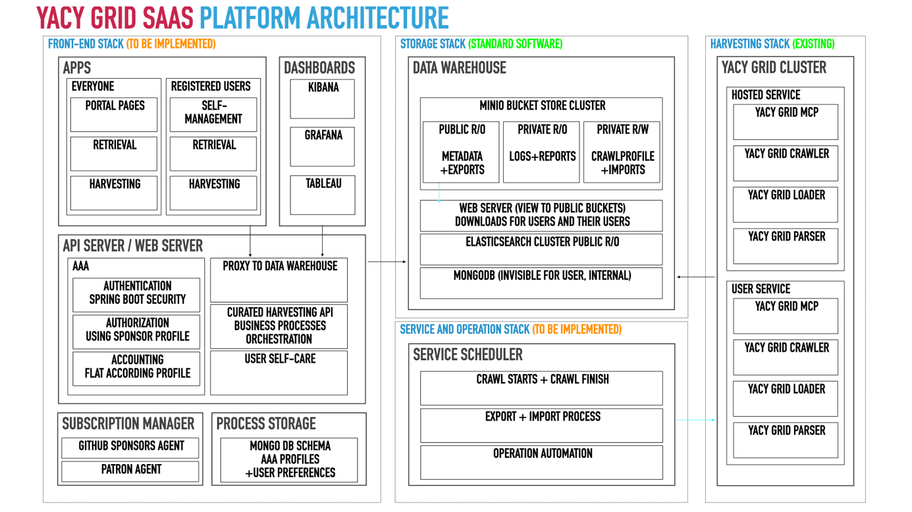
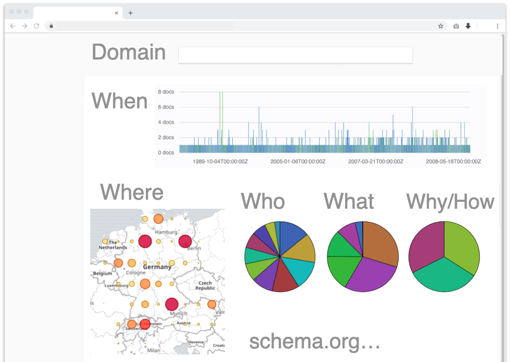

# About the Searchlab

YaCy Searchlab is an extension to the existing YaCy Grid Crawler technology. That technology has no user GUI interface and no service management integrated so far. The YaCy Grid Searchlab concept is extending that software with the required elements which makes it possible that users can sign up for web crawling tasks, do monitoring, using search applications and other tasks that are required for such a platform like user self-care and subscription management.

The concept requires that existing open source software (the YaCy Grid stack) is integrated with other FOSS elements (like storage technology) and extended with new elements. Those are marked as “to be implemented” in the picture above.

## The Searchlab Portal - A SaaS Platform

This portal was designed as Search-as-a-service Platform using YaCy Grid. We call it not the "Searchlab" and it is also the searchlab application which you can download yourself. All elements of the application can be used within your home or an intranet or as a cloud service that you set up yourself.

However, the construction of this application is done in such a way that you don't need to set-up anything yourself and use this portal instead.

## Integration of YaCy Grid into the Searchlab Portal

This milestone will provide active and running search functionality to the Searchlab portal as a demonstration. We will provide a new public search front-end for YaCy Grid. This portal will also be usable as static-code plug-in for any other web management systems  (forums, wikis, blogs etc) including configuration for personalized Search frontends.

Personalization functions for the search frontend will be provided.

## Data Studio: Application Widget Framework

This is a framework that makes it possible for users to provide their own data analytics widgets for the Searchlab web page. It will implement an app framework where everyone can use any kind of user-generated widget in the same way as the YaCy search page. The widgets may provide numerous analytics functions for details of a search index to harvest information, i.e. from semantic data markup content of web pages.

## Front-End and Back-End for Crawl Start management and Data Warehouse

The user must be able to start his/her own web crawl and show monitoring about running crawls and the outcome of finished crawls. To enable users to do so automatically, every action and monitoring must provide an external API for authorized users. The crawl result will generate a wide range of assets (WARC files, semantic content, statistics, index files etc.).

## Integration of an ACL Framework for Account Management

We require an account management for users to be able to sign-up and sign-in. We will provide a framework to empower the user to provide their own search content to their own users. The user accounts will also be connected to some limitations which may or may not be extended to larger quantities in case that the user supports the platform in one of the given options. 

